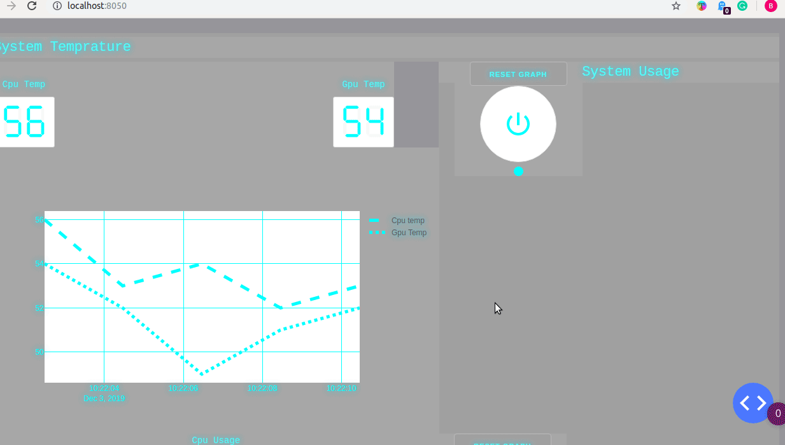
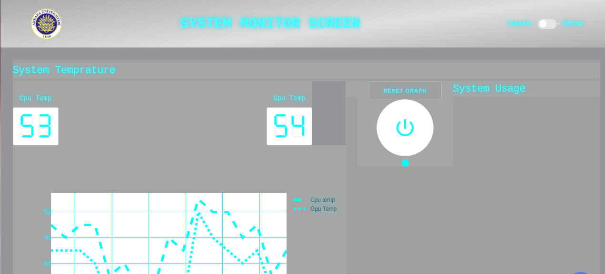
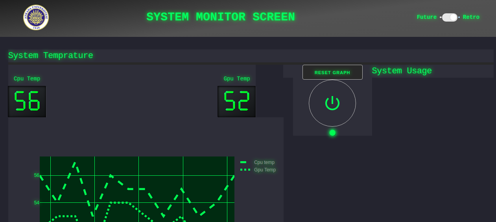
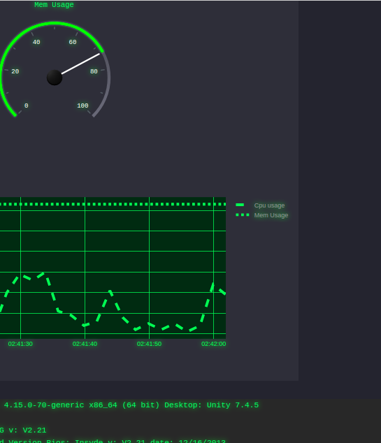

# Dash Os Monitor
An Os monitor web app written in dash plotly. Runs in GNU/Linux machine currently

## Installiation
You need to install inxi and python3. For debian based distro for apt:
```
sudo apt install inxi python3 python3-pip
```

this will install python3, python package manager and inxi

then install python libraries with pip

```
pip3 install -r requirements.txt
```
this will install required python libraries and packages

## Run

Type 
```
python3 app.py
```
in terminal. This start to serve app on localhost currently.
check localhost:8050 to see app.

Dash uses flask for backend. If you want to change serving options check this part of code
https://github.com/bhctsntrk/dash-os-monitor/blob/master/app.py#L389

and this page
https://flask.palletsprojects.com/en/1.1.x/deploying/

## Screenshots








